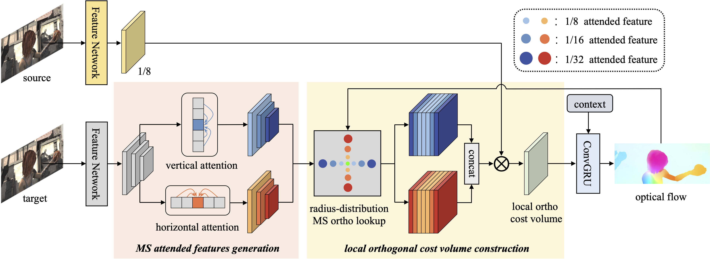

# MeFlow
[Memory-Efficient Optical Flow via Radius-Distribution Orthogonal Cost Volume](https://arxiv.org/pdf/2312.03790) <br/>
Gangwei Xu, Shujun Chen, Hao Jia, Miaojie Feng, Xin Yang <br/>

## Network architecture


## Comparison to Flow1D


## Flow results on 4K (2160×3840) resolution images


## Environment
* NVIDIA RTX 3090
* python 3.8
* torch 1.12.1+cu113

### Create a virtual environment and activate it.

```Shell
conda create -n meflow python=3.8
conda activate meflow
```
### Dependencies

```Shell
pip install torch==1.12.1+cu113 torchvision==0.13.1+cu113 torchaudio==0.12.1 --extra-index-url https://download.pytorch.org/whl/cu113
pip install tensorboard
pip install opencv-python
pip install scipy
pip install pillow==9.5.0
```

## Demos

All pretrained models can be downloaded from [google drive](https://drive.google.com/drive/folders/1ixJQGKhWDRwaeXlLNuGBD5dzI8CHIIg4?usp=drive_link).


You can run a trained model on a sequence of images and visualize the results:

```
bash ./scripts/demo.sh
```


## Datasets

The datasets used to train and evaluate HCVFlow are as follows:

* [FlyingChairs](https://lmb.informatik.uni-freiburg.de/resources/datasets/FlyingChairs.en.html#flyingchairs)
* [FlyingThings3D](https://lmb.informatik.uni-freiburg.de/resources/datasets/SceneFlowDatasets.en.html)
* [Sintel](http://sintel.is.tue.mpg.de/)
* [KITTI](http://www.cvlibs.net/datasets/kitti/eval_scene_flow.php?benchmark=flow)
* [HD1K](http://hci-benchmark.iwr.uni-heidelberg.de/)

By default the dataloader [datasets.py](data/datasets.py) assumes the datasets are located in folder `datasets` and are organized as follows:

```
datasets
├── FlyingChairs
│   └── data
├── FlyingThings3D
│   ├── frames_cleanpass
│   ├── frames_finalpass
│   └── optical_flow
├── HD1K
│   ├── hd1k_challenge
│   ├── hd1k_flow_gt
│   ├── hd1k_flow_uncertainty
│   └── hd1k_input
├── KITTI_2015
│   ├── testing
│   └── training
├── Sintel
│   ├── test
│   └── training
```

## Evaluation

You can evaluate a trained MeFlow model by running:

```
bash ./scripts/evaluate.sh
```

## Training

All training scripts on FlyingChairs, FlyingThings3D, Sintel and KITTI datasets can be found in [scripts/train.sh](scripts/train.sh).
You can train a MeFlow model by running:
```
bash ./scripts/train.sh
```

Following Flow1D, we support the use of tensorboard to monitor and visualize the training process. To begin, you can start a tensorboard session by
```shell
tensorboard --logdir checkpoints --port 6688
```

and then access [http://localhost:6688](http://localhost:6688) in your browser.


## Citation

If you find our work useful in your research, please consider citing our paper:

```bibtex
@article{xu2023memory,
  title={Memory-efficient optical flow via radius-distribution orthogonal cost volume},
  author={Xu, Gangwei and Chen, Shujun and Jia, Hao and Feng, Miaojie and Yang, Xin},
  journal={arXiv preprint arXiv:2312.03790},
  year={2023}
}
```

# Acknowledgements

This project is based on [Flow1D](https://github.com/haofeixu/flow1d), we thank the original authors for their excellent work.
