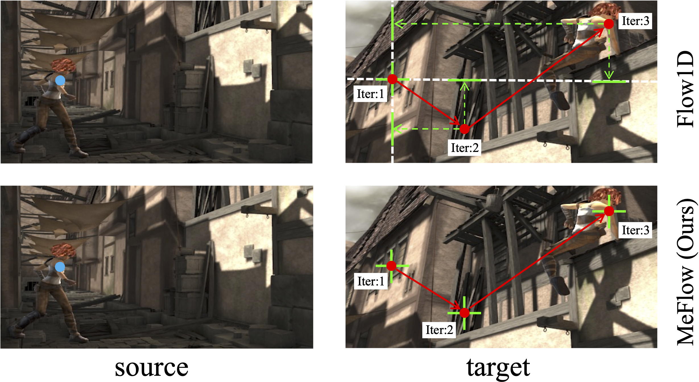

# MeFlow
[Memory-Efficient Optical Flow via Radius-Distribution Orthogonal Cost Volume](https://arxiv.org/pdf/2312.03790) <br/>
Gangwei Xu, Shujun Chen, Hao Jia, Miaojie Feng, Xin Yang <br/>

## Network architecture


## Comparison to Flow1D


## Flow results on 4K (2160×3840) resolution images


## Citation

If you find our work useful in your research, please consider citing our paper:

```bibtex
@article{xu2023memory,
  title={Memory-efficient optical flow via radius-distribution orthogonal cost volume},
  author={Xu, Gangwei and Chen, Shujun and Jia, Hao and Feng, Miaojie and Yang, Xin},
  journal={arXiv preprint arXiv:2312.03790},
  year={2023}
}
```

# Acknowledgements

This project is based on [Flow1D](https://github.com/haofeixu/flow1d), we thank the original authors for their excellent work.
